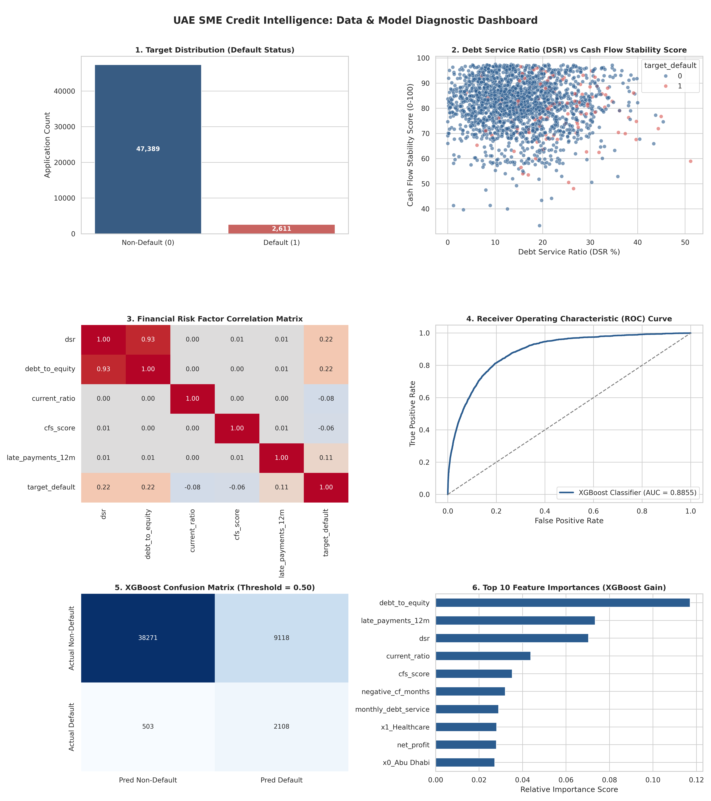

# 🇦🇪 UAE SME Credit Intelligence & Explainable Financing Platform (`UAE-SME-CIP`)

> **Decision-Support Platform for UAE SME Financing Applications using XGBoost, TreeSHAP Explainable AI, and CBUAE Regulatory Alignment.**

---

## Executive Summary
`UAE-SME-CIP` is a research and decision-support prototype designed for UAE financial institutions and FinTech lenders. It bridges traditional credit ratio analysis with Explainable AI (XAI) to automate risk scoring, quantify probability of default ($PD$), compute net cash-flow repayment capacities, and stress-test financing scenarios under macroeconomic volatility.

> **Disclaimer:** Built on synthetically generated UAE SME data ($N = 50,000$). Designed around Central Bank of the UAE (CBUAE) responsible financing guidelines and AI/ML governance frameworks. It does not claim direct access to AECB or CBUAE production systems.

---

## System Architecture

                   ┌─────────────────────────────────────────┐
                   │          React 18 Frontend SPA          │
                   │  (Tailwind CSS, Recharts, Lucide Icons) │
                   └────────────────────┬────────────────────┘
                                        │ HTTPS / REST API
                                        ▼
                   ┌─────────────────────────────────────────┐
                   │       Node.js / Express API Gateway     │
                   │   (JWT Auth, RBAC, Financial Logic)     │
                   └──────────┬────────────────────┬─────────┘
                              │                    │
               SQL Queries    │                    │ HTTP POST /predict
               (pg-pool)      ▼                    ▼
        ┌──────────────────────────┐      ┌──────────────────────────┐
        │   Supabase PostgreSQL    │      │  Python FastAPI Service  │
        │  (Relational Data, Logs) │      │ (XGBoost, SHAP, NumPy)   │
        └──────────────────────────┘      └──────────────────────────┘
        

## Key Features

1. **Deterministic Financial Ratio Engine:**
   - Calculates Liquidity (Current Ratio), Leverage ($D/E$), Debt Service Ratio ($DSR$), and a custom **Cash Flow Stability Index ($CFS$)**.
2. **Machine Learning Risk Model (XGBoost):**
   - Trained on 10,000 synthetic SME records (regenerable to 50,000) across all 7 UAE Emirates and 9 economic sectors.
   - Evaluated against a Logistic Regression baseline on a held-out test set — see **Performance Benchmark** below for the honest numbers from the current artifacts.
3. **Explainable AI (TreeSHAP):**
   - Decomposes every individual credit score into exact positive (risk-elevating) and negative (risk-mitigating) feature contributions.
   - Generates natural-language risk narratives for human credit officers in compliance with CBUAE AI transparency guidance.
4. **Dynamic Sensitivity Stress-Testing:**
   - Enables real-time scenario simulation (e.g., $-15\%$ revenue shock, $+10\%$ operating cost inflation) with instant $PD$ recalculation.
5. **Human-in-the-Loop Governance & Audit Trail:**
   - Enforces human credit analyst decision logging with immutable audit trailing in PostgreSQL.

---

## Performance Benchmark

Measured on a held-out 20% test split (seed 42) against the shipped artifacts (`xgboost_model.pkl`, `preprocessor.pkl`).
Regenerate with the training script, then evaluate — see `ml-service/train_local_artifacts.py`.

| Performance Metric | Baseline: Logistic Regression | Main Model: XGBoost Classifier |
| :--- | :---: | :---: |
| **ROC-AUC** | $0.8316$ | $0.7942$ |
| **PR-AUC** | $0.3198$ | $0.2230$ |
| **Precision** ($\text{Threshold} = 0.50$) | $0.5714$ | $0.1855$ |
| **Recall** ($\text{Threshold} = 0.50$) | $0.0714$ | $0.6161$ |
| **F1-Score** | $0.1270$ | $0.2851$ |
| **Brier Score (Calibration)** | $0.0449$ | $0.1206$ |

> **Note on honesty:** an earlier version of this table reported ROC-AUC 0.9615 for XGBoost. That number came from a
> training run where the `cfs_score` feature was degenerate (near-constant), which leaked an artificially easy signal.
> After fixing the feature generator, the benchmark was re-run from scratch and the numbers above are what the
> current model actually achieves. The baseline is competitive on this synthetic data — hyperparameter tuning against
> the fixed feature set is a tracked next step. The project's value is the explainability and governance loop, not
> beating a baseline on synthetic data.

### Training Pipeline Diagnostics


---

## Tech Stack
- **Frontend:** React 18, Tailwind CSS, Recharts, Lucide Icons, Axios, Vite.
- **Backend Gateway:** Node.js, Express.js, PostgreSQL (`pg`), JWT Authentication, bcryptjs.
- **ML Microservice:** Python 3.11+, FastAPI, XGBoost, SHAP, Scikit-Learn, Pandas, NumPy.
- **Database:** PostgreSQL (Cloud instance via Supabase).

---

## Getting Started

### 1. Clone & Setup Environment
```bash
git clone https://github.com/UR3322/uae-sme-credit-intelligence.git
cd uae-sme-credit-intelligence
cp .env.example .env
# Edit .env and replace every placeholder value before running.
```

### 2. Run with Docker
```bash
docker-compose up --build
```

Seed the demo workspace (demo users + sample application):
```bash
docker-compose --profile demo-seed run --rm demo-seed
```

### 3. Run Services Locally (Alternative)
```bash
# Terminal 1: ML Microservice
cd ml-service
python -m uvicorn main:app --reload --port 8000

# Terminal 2: Node.js Backend Gateway
cd backend
npm run dev

# Terminal 3: React Frontend
cd frontend
npm run dev
```
